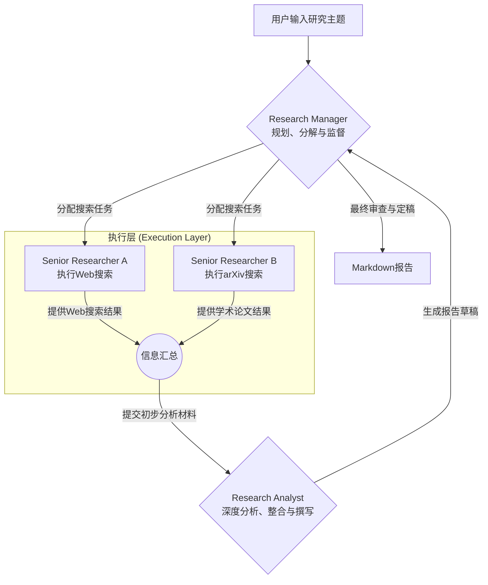

# 多智能体科研助手 (Multi-Agent Research Assistant)

一个基于CrewAI的多智能体系统，用于自动化生成结构化研究报告。只需一个自然语言指令，系统即可自动完成从规划、搜索到分析的完整研究流程。

> 一次10分钟,0.3元,搜索文献10+篇;终端展现思考过程.

## ✨ 功能特点

- 🤖 **多智能体协作**: 基于CrewAI的分层协作架构
- 🔍 **智能搜索**: 整合Web搜索和arXiv学术数据库
- 📊 **自动报告**: 生成结构化Markdown格式研究报告  
- ⚡ **高效流程**: 并行搜索和智能任务分配
- 🌐 **多数据源**: 支持学术论文、技术新闻、产业动态
- 💻 **双界面**: 命令行和Web界面两种使用方式
- 🎯 **高质量**: 批判性分析和引用验证

## 🚀 快速开始

### 方法一：一键安装（推荐）

```bash
python quick_start.py
```

这个脚本会自动帮您安装依赖、配置环境和运行测试。

### 方法二：手动安装

1. **安装依赖**
```bash
pip install -r requirements.txt
```

2. **配置API密钥**
```bash
cp env_example.txt .env
# 编辑.env文件，填入您的OpenAI和Tavily API密钥
```

3. **运行系统**
```bash
# 命令行模式
python main.py

# Web界面模式  
streamlit run app.py
```

详细安装指南请查看 [INSTALL.md](INSTALL.md)

## 🏗️ 系统架构



### 三个核心智能体

- **🎯 Research Manager**: 研究经理，负责规划分解任务和质量把控
- **🔍 Senior Researcher**: 高级研究员，负责多源信息搜集
- **📝 Research Analyst**: 研究分析师，负责深度分析和报告撰写

## 📋 使用示例

### 命令行模式

```bash
# 交互模式
python main.py

# 直接指定主题
python main.py "大语言模型的上下文窗口扩展技术"
```

### Web界面模式

```bash
streamlit run app.py
```

### 研究主题示例

- "自2024年以来视频生成模型的最新技术突破"
- "多模态AI在医疗诊断中的应用现状和挑战"  
- "强化学习在自动驾驶中的最新进展"
- "大语言模型的安全性和可解释性研究"

## 📊 输出示例

生成的研究报告包含：

- **执行摘要**: 核心发现的3-5句话概括
- **引言背景**: 研究主题的重要性和背景
- **核心发现**: 最新技术突破和关键进展
- **深度分析**: 技术对比、优势挑战分析
- **趋势预测**: 基于当前发现的未来发展方向
- **结论建议**: 总结性结论和实用建议
- **参考文献**: 完整的引用来源和链接

报告示例：`reports/research_report_xxx.md`

## 🛠️ 技术栈

| 组件 | 技术方案 | 说明 |
|------|----------|------|
| **多智能体框架** | CrewAI | 提供角色-任务-工具协作模型 |
| **核心LLM** | DeepSeek Chat | 高性能中文大语言模型，支持长文本处理 |
| **Web搜索** | Tavily AI Search API | 专为AI设计的搜索引擎 |
| **学术搜索** | arXiv API | 获取最新预印本论文 |
| **Web界面** | Streamlit | 快速构建用户友好界面 |
| **开发语言** | Python 3.8+ | AI和数据科学标准语言 |

## 🔧 故障排查

如果您在安装或使用过程中遇到任何问题，请查阅 **[解决方案.md](./解决方案.md)** 获取详细的故障排查指南和常见问题解答。

## 📁 项目结构

```
Multi-AgentResearchAssistant/
├── main.py                 # 主程序入口
├── app.py                  # Streamlit Web界面
├── quick_start.py          # 快速安装脚本
├── test_config.py          # 系统测试脚本
├── requirements.txt        # 依赖包列表
├── INSTALL.md             # 详细安装指南
├── 解决方案.md             # 故障排查指南
├── agents/                # 智能体定义
│   ├── __init__.py
│   └── research_agents.py
├── tasks/                 # 任务定义
│   ├── __init__.py
│   └── research_tasks.py
├── tools/                 # 自定义工具
│   ├── __init__.py
│   └── arxiv_tool.py
└── reports/               # 生成的报告（自动创建）
```

## 🔧 配置选项

### 环境变量 (.env)

```bash
# 必需的API密钥
OPENAI_API_KEY="sk-your-deepseek-key"
OPENAI_API_BASE="https://api.deepseek.com"
TAVILY_API_KEY="tvly-your-tavily-key"

# 模型配置
OPENAI_MODEL_NAME="deepseek-chat"    # 可选: deepseek-chat, deepseek-coder
OPENAI_TEMPERATURE=0.7               # 0.0-1.0, 控制输出随机性

# 搜索配置  
MAX_SEARCH_RESULTS=5                 # 每次搜索的最大结果数
```

### 模型选择指南

- **deepseek-chat**: 通用对话模型，适合各类研究主题
- **deepseek-coder**: 代码专用模型，适合技术和编程相关研究

### API获取

**DeepSeek API密钥获取：**
1. 访问 [DeepSeek开放平台](https://platform.deepseek.com/)
2. 注册账户并完成认证
3. 在控制台创建API密钥
4. 复制密钥到.env文件中

**重要说明：**
- 系统会自动为模型名称添加 `openai/` 前缀以满足LiteLLM要求
- 您只需在.env文件中配置 `deepseek-chat` 或 `deepseek-coder`
- 无需手动添加前缀

## 🔍 高级功能（规划中）

- **🧠 长期记忆**: 基于向量数据库的历史研究记忆
- **✅ 质量验证**: 增加Validator智能体进行事实核查  
- **⚡ 异步执行**: 并发搜索提升执行效率
- **📚 多数据源**: 支持Google Scholar、PubMed等
- **🌍 多语言**: 支持中文等多语言研究报告

## 🤝 贡献

欢迎提交Issue和Pull Request来改进项目！

## 📄 许可证

MIT License - 详见 [LICENSE](LICENSE) 文件

## 🙏 致谢

- [CrewAI](https://github.com/joaomdmoura/crewAI) - 强大的多智能体框架
- [Tavily AI](https://tavily.com/) - 专业的AI搜索API
- [arXiv](https://arxiv.org/) - 开放的学术预印本库
