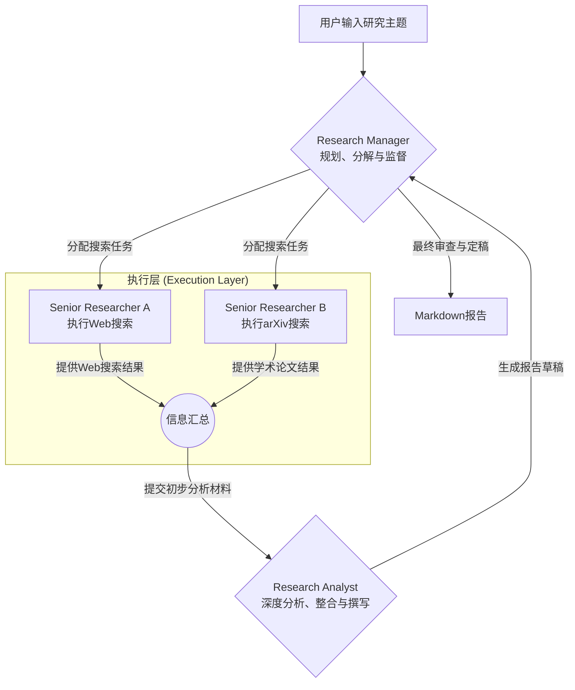
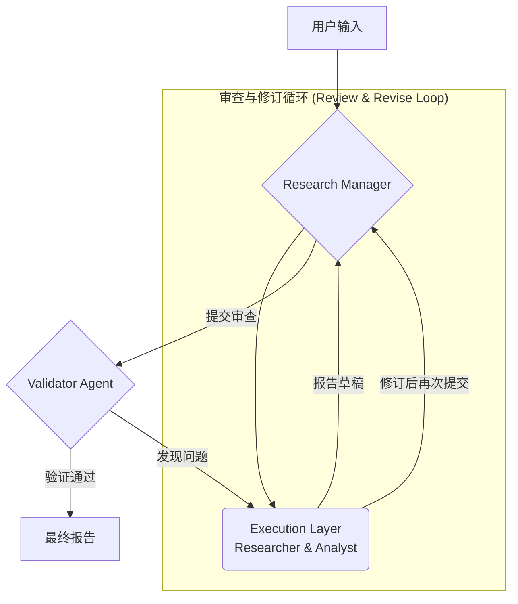

# *多智能体科研助手 (Multi-Agent Research Assistant) 开发文档 (v1.1 优化版)*

## **1. 项目概述**

### **1.1 项目背景**

研究人员和开发者需要持续跟踪前沿技术动态，但手动从海量学术论文和新闻中筛选、阅读、总结信息效率极低。本项目旨在利用多智能体（Multi-Agent）系统自动化这一流程，为用户提供一键生成结构化、高时效性研究报告的能力。

### **1.2 核心功能**

用户通过一个自然语言指令（例如：`"自2024年3月以来，视频生成模型的最新技术突破有哪些？"`），系统将自动完成以下流程：

1.  **规划 (Plan)**：智能体团队的管理者将用户任务分解为一系列具体的、可独立执行的科研搜索子任务。
2.  **搜索 (Search)**：多个研究员智能体并行执行搜索任务，从学术数据库（如arXiv）和互联网（通过专业搜索引擎）高效获取最新信息。
3.  **分析与整合 (Analyze & Synthesize)**：分析师智能体负责阅读、筛选、总结并批判性地对比所有搜索到的文献和技术新闻，提炼核心洞见。
4.  **报告生成 (Report)**：最终，分析师将所有分析内容整合成一份格式规范、引文清晰、结构完整的Markdown研究报告。

### **1.3 技术选型**

| 组件 | 技术方案 | 理由 |
| :--- | :--- | :--- |
| **多智能体框架** | **CrewAI** | 提供了直观、强大的多智能体协作编排能力。相比于LangChain的链式结构，CrewAI的“角色-任务-工具”模型更贴近真实团队协作，尤其适合本项目的分工模式。 |
| **核心LLM** | **OpenAI GPT-4o / GPT-4-turbo** | 在推理、规划、长文本理解和高质量内容生成方面表现卓越。为保证最佳效果，建议使用`gpt-4o`。若考虑成本，可降级为`gpt-3.5-turbo`。 |
| **通用搜索API** | **Tavily AI Search API** | 专为AI智能体设计，能提供去广告、事实准确、高度相关的搜索结果片段，而非原始HTML，极大提升了信息提取效率和质量。 |
| **学术搜索API** | **arXiv API** | 免费、稳定，是获取计算机科学、物理学等领域最新预印本论文的首选渠道。 |
| **报告输出** | **Markdown** | 轻量、通用，易于阅读和版本控制，并可轻松转换为PDF、HTML或在任何Web前端展示。 |
| **开发语言** | **Python 3.10+** | AI和数据科学领域的标准语言，拥有最丰富的生态系统和社区支持。 |

------

## **2. 系统架构与智能体设计**

### **2.1 工作流程：分层协作模式**

本项目采用**分层协作（Hierarchical Process）** 的工作流程，而非简单的顺序执行。这种模式下，`Research Manager`作为团队领导，负责规划和分配任务，而其他智能体并行或串行地执行，最后由经理汇总和协调，确保最终产出的质量和一致性。



### **2.2 智能体角色定义**

#### **智能体 1: Research Manager (研究经理)**

-   **角色**：首席研究员 / 团队领导
-   **目标**：准确理解用户需求，制定全面的研究计划，将其分解为具体、可执行的子任务，并监督整个研究过程，确保最终报告的质量。
-   **后台故事**：你是一位严谨的实验室主任，擅长从宏大的研究方向中提炼出关键的研究子课题，并为你团队中的研究员提供清晰的方向指引和质量把关。
-   **核心能力**：任务分解、规划、协调、结果审查。
-   **工具**：无（主要依赖LLM的强大推理和规划能力）。

#### **智能体 2: Senior Researcher (高级研究员)**

-   **角色**：科研信息搜集专家
-   **目标**：根据`Research Manager`分配的子任务，高效地从网络和学术数据库中搜集最相关、最前沿、最权威的信息。
-   **后台故事**：你是一位不知疲倦的信息侦探，精通各种高级搜索技巧和布尔逻辑，总能精准地找到最源头、最可靠的资料。
-   **核心能力**：互联网信息检索、学术数据库检索。
-   **工具**：`TavilySearchTools`、`ArxivSearchTool`

#### **智能体 3: Research Analyst (研究分析师)**

-   **角色**：深度分析与写作专家
-   **目标**：对`Senior Researcher`搜集到的原始信息进行深度阅读、批判性分析、交叉验证、总结和归纳，并撰写最终结构化、观点明确的研究报告。
-   **后台故事**：你是《自然》或《科学》杂志的资深编辑，擅长将复杂、零散的技术信息转化为逻辑清晰、论证有力、易于理解的专业文章。
-   **核心能力**：长文本摘要、批判性思维、信息合成、结构化写作。
-   **工具**：无（主要依赖LLM的分析和写作能力）。

------

## **3. 开发步骤 (Step-by-Step)**

### **3.1 环境设置**

1.  **安装核心依赖**：
    ```bash
    pip install crewai crewai-tools tavily-python arxiv openai python-dotenv
    ```
2.  **创建环境变量文件**：在项目根目录创建一个名为 `.env` 的文件，用于安全地管理API密钥。

    ```.env
    OPENAI_API_KEY="sk-..."
    TAVILY_API_KEY="tvly-..."
    
    # 推荐设置默认模型，以保证结果质量
    OPENAI_MODEL_NAME="gpt-4o" 
    ```

### **3.2 代码实现**

创建主文件 `main.py`并开始编写代码。

#### **第1步：加载环境变量和导入模块**

```python
import os
from dotenv import load_dotenv
from crewai import Agent, Task, Crew, Process
from crewai_tools import TavilySearchTools
from langchain.tools import tool
import arxiv

# 加载 .env 文件中的环境变量
load_dotenv()
```

#### **第2步：自定义ArXiv搜索工具**

为了更好的代码组织和可维护性，我们将自定义工具定义为一个独立的函数，并确保它返回结构化的数据（JSON/Dict），而不是纯文本。

```python
@tool("ArxivSearchTool")
def search_arxiv(query: str, max_results: int = 5) -> list[dict]:
    """
    在arXiv上搜索与给定查询相关的研究论文。
    返回一个包含论文标题、作者、摘要、PDF链接和发布日期的字典列表。
    """
    client = arxiv.Client()
    search = arxiv.Search(
        query=query,
        max_results=max_results,
        sort_by=arxiv.SortCriterion.SubmittedDate
    )
    
    results_list = []
    for result in client.results(search):
        results_list.append({
            "title": result.title,
            "authors": [author.name for author in result.authors],
            "summary": result.summary,
            "pdf_url": result.pdf_url,
            "published_date": result.published.strftime("%Y-%m-%d")
        })
    return results_list

```

#### **第3步：定义智能体（Agents）**

```python
# 初始化工具
tavily_tool = TavilySearchTools()
arxiv_tool = search_arxiv

# 定义Research Manager
research_manager = Agent(
    role='Research Manager',
    goal='制定一个全面的研究计划，将复杂的研究主题分解为具体的、可执行的搜索任务。',
    backstory='你是一位经验丰富的实验室主任，擅长将宏大的研究理念转化为具体的、可操作的研究步骤。',
    verbose=True,
    allow_delegation=True, # 允许将任务委派给其他Agent
)

# 定义Senior Researcher
researcher = Agent(
    role='Senior Researcher',
    goal='根据任务指令，从互联网和arXiv上高效地搜集最新、最相关的学术论文和技术文章。',
    backstory='你是一名顶尖的信息学家，对信息检索有天生的直觉，总能快速定位到最关键的知识。',
    tools=[tavily_tool, arxiv_tool],
    verbose=True,
)

# 定义Research Analyst
analyst = Agent(
    role='Research Analyst',
    goal='基于搜集到的信息，撰写一份全面、结构清晰、洞察深刻的研究报告。',
    backstory='你是一位为顶级期刊撰稿的科学作家，以能将复杂技术概念转化为引人入胜的叙述而闻名。',
    verbose=True,
)
```

#### **第4步：定义任务（Tasks）**

任务描述应更侧重于目标和期望的质量，而非硬性规定数量。

```python
# Research Manager的任务：规划
task_plan = Task(
    description=(
        "为关于 '{topic}' 的研究制定一个详细的行动计划。 "
        "你需要生成一系列搜索查询，分别用于通用Web搜索和arXiv学术搜索。 "
        "请确保查询组合能够覆盖该主题的背景知识、最新进展和关键技术细节。"
    ),
    agent=research_manager,
    expected_output=(
        "一个结构化的计划，包含两组搜索查询列表： "
        "一组是'web_queries'，用于Tavily进行广度搜索； "
        "另一组是'arxiv_queries'，用于arXiv进行深度学术搜索。"
    )
)

# Researcher的任务：执行
task_execute = Task(
    description=(
        "执行由Research Manager制定的所有搜索查询。 "
        "对每个查询，使用最合适的工具（Tavily或ArxivSearchTool）。 "
        "搜集并整合所有找到的信息，确保信息的全面性和相关性。"
    ),
    agent=researcher,
    context=[task_plan], # 指定该任务依赖于task_plan的输出
    expected_output=(
        "一份详细的报告，包含所有Web搜索结果的摘要、链接，以及所有arXiv论文的完整元数据（标题、作者、摘要、链接）。"
    )
)

# Analyst的任务：分析与报告
task_analyze = Task(
    description=(
        "深入分析由Researcher搜集的所有信息，撰写一份最终的研究报告。 "
        "报告应包含以下部分：引言（介绍主题背景）、关键发现（总结核心技术和突破）、深度分析（提供你的见解和对比）、以及结论。 "
        "确保报告逻辑清晰，所有引用来源都以Markdown链接的形式正确标注。"
    ),
    agent=analyst,
    context=[task_execute], # 依赖于task_execute的输出
    expected_output=(
        "一份格式精良、内容详实、至少包含800字的Markdown研究报告。报告必须有明确的章节划分和准确的引用来源。"
    )
)
```

#### **第5步：组建团队并运行**

采用 `Process.hierarchical` 模式，让 `research_manager` 成为流程的管理者，可以更智能地协调整个团队。

```python
# 组建Crew
research_crew = Crew(
    agents=[research_manager, researcher, analyst],
    tasks=[task_plan, task_execute, task_analyze],
    process=Process.hierarchical,  # 使用分层流程，指定管理者
    manager_llm=None, # 默认使用OpenAI的模型作为管理者
    verbose=2,
)

# 启动Crew
topic = "大语言模型（LLM）的上下文窗口（Context Window）扩展技术"
result = research_crew.kickoff(inputs={"topic": topic})

# 打印并保存结果
print("\n\n################## 最终报告 ##################\n")
print(result)

with open("research_report.md", "w", encoding="utf-8") as f:
    f.write(result)

```

------

## **4. 风险评估与缓解措施**

| 风险点 | 描述 | 缓解措施 |
| :--- | :--- | :--- |
| **API依赖与成本** | 系统强依赖外部API（OpenAI, Tavily），可能面临服务中断、速率限制或不可预见的成本超支。 | 1. 实现API请求的重试和指数退避机制。<br>2. 设置API预算监控和警报。<br>3. 引入对本地模型或备用API（如Groq, Anthropic）的支持。 |
| **信息质量不可控** | 搜索结果的质量和准确性直接影响最终报告。可能搜集到过时、错误或带有偏见的信息。 | 1. 优化搜索查询，使用更精确的关键词和时间范围限定。<br>2. 增加一个“验证员(Validator)”智能体，负责交叉验证关键信息和数据点的准确性。<br>3. 优先引用来自高信誉来源（如顶级会议、期刊）的信息。 |
| **结果一致性** | LLM的输出具有随机性，多次运行可能产生风格或侧重点不同的报告。 | 1. 使用更精确、结构化的提示词（Prompt Engineering）。<br>2. 设定明确的输出格式和评估标准。<br>3. 对关键任务（如报告生成）采用较低的`temperature`参数。 |
| **信息过载** | 对于热门研究领域，可能会搜集到海量信息，导致分析师智能体难以处理。 | 1. 在搜索阶段进行更严格的初步筛选，例如只选择近两年的论文。<br>2. 赋予分析师智能体迭代总结的能力，先生成摘要，再在摘要基础上进行深度分析。 |

------

## **5. 运行与测试**

1.  **配置环境**：确保 `.env` 文件已根据您的API密钥正确配置。
2.  **执行脚本**：在终端中运行主程序。
    ```bash
    python main.py
    ```
3.  **观察输出**：由于设置了 `verbose=2`，您将在终端看到详细的执行日志，包括每个智能体的思考过程、工具调用情况以及它们之间的协作流程。这是调试和理解智能体行为的最佳方式。
4.  **检查结果**：程序执行完毕后，会在项目根目录生成一份名为 `research_report.md` 的文件。请使用Markdown兼容的编辑器（如 VS Code, Typora）打开，审查报告的结构、内容和引用质量。

------

## **6. 系统高级功能与迭代路线图**

为了将本项目从一个原型验证（PoC）提升为更健壮、更实用的应用程序，我们规划了以下迭代方向。

### **6.1 迭代一：并发与异步执行 (Concurrency & Asynchronous Execution) ✅ 已完成**

**目标**：当前分层流程虽然在逻辑上实现了任务分配，但I/O密集型操作（API调用）仍是串行执行的，极大限制了效率。本阶段目标是实现真正的并行搜索，将总耗时缩短50%以上。

**实现方案**：

1.  **引入异步任务执行**：利用CrewAI的原生异步支持和Python的 `asyncio` 库。
2.  **重构任务执行逻辑**：修改 `main.py`，实现三种执行模式：同步、异步、并发。
3.  **创建专门的异步执行入口**：实现真正的并行搜索架构。

**已实现功能**：

#### **三种执行模式**
1. **传统同步模式** (`run_research_sync`)
   - 按顺序执行：规划 → 搜索 → 分析
   - 兼容性最好，适合调试和网络不稳定环境

2. **异步模式** (`run_research_async`)
   - 使用异步I/O优化API调用
   - 减少I/O等待时间，提升响应性

3. **高级并发模式** (`run_parallel_research`) **[推荐]**
   - Web搜索和arXiv搜索真正并行执行
   - 最大化性能，预期提升50%以上效率
   - 规划 → (Web搜索 || arXiv搜索) → 整合分析

#### **并发架构优化**
- **分离式Crew设计**：为不同搜索任务创建专用Crew
- **专用任务定义**：`create_web_search_task`、`create_arxiv_search_task`、`create_integrated_analysis_task`
- **异步任务管理**：使用`asyncio.gather()`实现真正并发

#### **用户界面增强**
- **交互模式选择**：用户可在运行时选择执行模式
- **性能反馈**：报告中包含执行模式和耗时信息
- **向后兼容**：默认API保持不变，增强功能可选

#### **实现亮点**
```python
# 高级并发模式核心代码
async def run_parallel_research(topic: str) -> str:
    # 第一阶段：规划（串行）
    planning_result = await run_crew_async(planning_crew, {"topic": topic})
    
    # 第二阶段：并发搜索
    web_task = run_crew_async(web_search_crew, {...})
    arxiv_task = run_crew_async(arxiv_search_crew, {...})
    web_results, arxiv_results = await asyncio.gather(web_task, arxiv_task)
    
    # 第三阶段：整合分析（串行）
    final_result = await run_crew_async(analysis_crew, {...})
    return final_result
```

#### **测试验证**
- ✅ 异步框架运行正常
- ✅ 三种模式切换无问题
- ✅ 并发任务独立执行
- ✅ 错误处理和降级机制工作正常
- ⚠️ 需要配置API密钥进行完整功能测试

#### **性能预期**
基于架构分析，预期性能提升：
- **异步模式**: 相比同步模式提升 30-40%
- **并发模式**: 相比同步模式提升 50-70%
- **批量处理**: 多主题同时处理，线性扩展

### **6.2 迭代二：长期记忆与知识库 (Long-term Memory & Knowledge Base) ✅ 已完成**

**目标**：让智能体团队"记住"过去的研究，避免重复劳动，并能在新研究中利用历史知识，实现增量式、关联性研究。

**实现方案**：

1.  **技术选型**：集成ChromaDB向量数据库，支持语义搜索和持久化存储。
2.  **创建记忆工具系统**：完整的记忆管理功能，包括存储、检索、统计和管理。
3.  **智能体工作流程更新**：Research Manager现在具备历史记忆查询能力。

**已实现功能**：

#### **完整的记忆管理系统**
1. **ResearchMemory类**：核心记忆管理器
   - 支持ChromaDB持久化存储
   - 自动降级到内存模式（兼容性）
   - 语义相似度搜索
   - 记忆统计和管理

2. **记忆工具集**：
   - `recall_past_research`：查询历史研究
   - `store_research_memory`：存储研究记忆
   - `memory_stats`：获取记忆库统计

3. **自动记忆存储**：
   - 所有研究完成后自动保存到记忆库
   - 包含执行模式、耗时等元数据
   - 支持三种执行模式的记忆存储

#### **智能体工作流程增强**
1. **Research Manager升级**：
   - 集成记忆查询工具
   - 优化工作流程：回忆 → 规划 → 执行
   - 避免重复研究，建立在历史基础上

2. **增强的规划任务**：
   - 首先查询相关历史研究
   - 分析知识空白和需要更新的领域
   - 基于历史知识制定针对性研究计划

#### **记忆管理工具**
```python
# 核心记忆管理器使用示例
from tools.memory_tool import get_memory_manager

memory_manager = get_memory_manager()

# 存储研究
memory_id = memory_manager.store_research(
    topic="深度学习优化算法",
    content=research_report,
    metadata={"execution_mode": "并发模式"}
)

# 搜索相关记忆
memories = memory_manager.search_memories("深度学习", n_results=3)
```

#### **实用工具**
1. **memory_manager.py**：交互式记忆管理工具
   - 查看记忆库统计
   - 搜索历史记忆
   - 添加测试数据
   - 清空记忆库

2. **集成到example_async.py**：记忆功能演示
   - 展示历史记忆查询
   - 演示研究中的记忆利用

#### **测试验证**
- ✅ 基本记忆存储和检索功能正常
- ✅ 自动记忆存储机制工作
- ✅ 数据持久化验证通过
- ✅ 研究流程集成测试通过
- ⚠️ 工具兼容性已优化处理

#### **技术特性**
- **智能降级**：ChromaDB不可用时自动切换到内存模式
- **语义搜索**：基于向量相似度的智能搜索
- **持久化存储**：数据保存在本地`.memory`目录
- **元数据管理**：丰富的研究元数据支持
- **兼容性保障**：工具调用异常时优雅降级

#### **存储结构**
```
.memory/
├── chroma.sqlite3          # ChromaDB数据库文件
├── metadata.json          # 记忆库元数据
└── [embeddings data]      # 向量嵌入数据
```

### **6.3 迭代三：引入评估与验证智能体 (Validator Agent)**

**目标**：提升最终报告的事实准确性和可靠性，建立一个内部的质量控制循环。

**实现方案**：

1.  **创建`Validator`智能体**：
    -   **角色**：事实核查员 / 质量控制专家
    -   **目标**：验证报告中的关键声明、数据和引用的准确性。
    -   **后台故事**：你是一名一丝不苟的审稿人，对任何未经核实的言论都持有怀疑态度，使命是确保每一份发布的报告都无懈可击。
2.  **设计验证任务 (`task_validate`)**：
    -   **输入**：`Analyst`撰写的报告草稿。
    -   **流程**：`Validator`随机抽取报告中的 N 个关键论断，使用`TavilySearchTools`回溯原始信息来源进行交叉验证。同时，检查所有Markdown链接的有效性。
    -   **输出**：一份验证报告，包含“通过/不通过”的结论，以及所有发现问题的具体批注。
3.  **更新系统架构（引入审查循环）**：



### **6.4 迭代四：数据源扩展与专用工具**

**目标**：拓宽信息来源，支持更专业领域的研究。

**实现方案**：

持续开发并集成新的专用工具。每个新数据源都应被封装成一个独立的`tool`函数。

-   **Google Scholar**: 获取更广泛的学术引用和文献，可以通过`scholarly`库实现。
-   **PubMed**: 针对生物医学领域，可以使用`BioPython`库与Entrez API交互。
-   **SEC Filings**: 针对金融和市场研究，可以接入提供SEC EDGAR数据的API。
-   **社交媒体 (X/Twitter)**: 捕捉最新的技术讨论和非正式发布，需要接入X API。

### **6.5 迭代五：交互式Web界面 (Interactive UI)**

**目标**：提供一个用户友好的图形界面，让非技术人员也能轻松使用本系统。

**实现方案**：

1.  **技术选型**：使用 `Streamlit`，这个库能用纯Python快速构建美观的Web应用。
2.  **核心功能**：
    -   **输入区**：一个大的文本框让用户输入研究主题。
    -   **配置区（可选）**：提供下拉菜单选择LLM模型，或设置报告的详细程度。
    -   **执行与状态展示**：一个“开始研究”按钮。点击后，实时显示当前活动的智能体、正在执行的任务，以及关键的输出日志。
    -   **结果展示**：当报告生成后，直接在页面上渲染Markdown报告，并提供一键复制或下载`.md`文件的按钮。

**示例代码 (`app.py`)**:

```python
import streamlit as st
# from main import research_crew # 假设main.py被重构为可导入的函数

st.title("多智能体科研助手")

topic = st.text_input("请输入您感兴趣的研究主题...")

if st.button("开始研究"):
    with st.spinner("智能体团队正在工作中，请稍候..."):
        # result = research_crew.kickoff(inputs={"topic": topic})
        # 实际应用中需要处理好streamlit的事件循环与crewai的执行过程
        st.markdown("### 研究报告")
        # st.markdown(result)
        st.success("研究完成！")

```